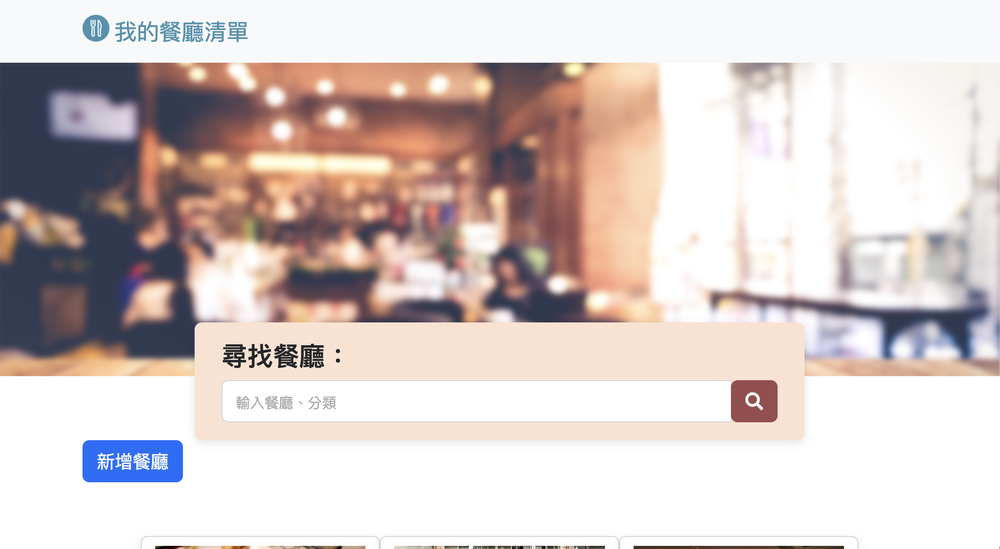

# 打造餐廳清單 重構路由及mongoose


## 介紹
學期2-3(後端), week 3, A8:重構餐廳清單

### 功能
* 查看所有餐廳
* 可用餐廳名稱和分類搜尋
* 可進入餐廳詳細資訊
* 可在詳細資訊內連結到google map
* 可新增餐廳
* 可編輯餐廳內容
* 可刪除餐廳


## 開始使用
* 確認安裝npm, Node.js
* 將專案clone到本地
* 本地開啟後，透過終端機進入資料夾，輸入：```npm install```
* 安裝完畢後，輸入：```npm start```
* 成功的話會在終端機看到：```Express is running on http://localhost:3000```
```mongodb connected!```
* 打開瀏覽器進入：```http://localhost:3000```
* 欲暫停，輸入：```control + c```

## 開發工具
* Node.js 18.12.1
* Express 4.16.4
* Express-Handlebars 3.0.0
* Bootstrap 5.2.1
* Font-awesome 5.8.1
* method-override 3.0.0
* mongoose 5.9.7
* dotenv 16.0.3
